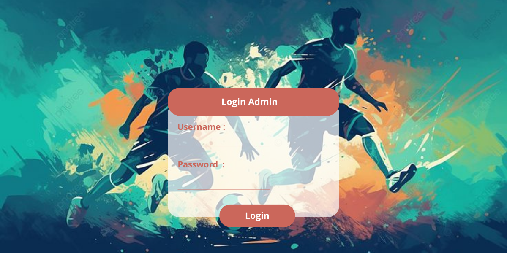
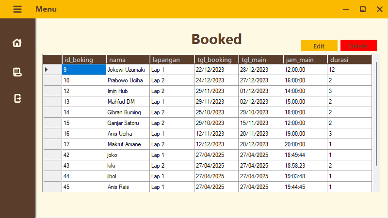
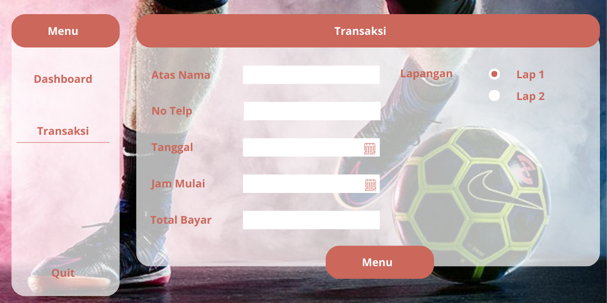

# Yan Yusril Muzaky
# 2213020259

Halaman Login

Halaman Dashboard

Halaman Transaksi

#Deskripsi Proyek: Aplikasi Booking Futsal
Aplikasi ini dibuat menggunakan C# Windows Forms di Visual Studio 2022 untuk mempermudah pengguna dalam melakukan pemesanan lapangan futsal.

#Fitur Aplikasi:
Tambah Booking → Pengguna dapat memasukkan Nama, memilih Lapangan, serta menentukan Tanggal & Jam booking.
Simpan Data ke Database → Setiap booking yang dibuat akan langsung disimpan ke dalam database MySQL.
Tampilkan Data Booking → Data booking yang tersimpan akan otomatis ditampilkan di DataGridView saat aplikasi dijalankan.

#Teknologi yang Digunakan:
Bahasa: C#
Framework: .NET Windows Forms
Database: MySQL
IDE: Visual Studio 2022

Aplikasi ini memudahkan pengelolaan data booking lapangan futsal secara real-time menggunakan database MySQL!

